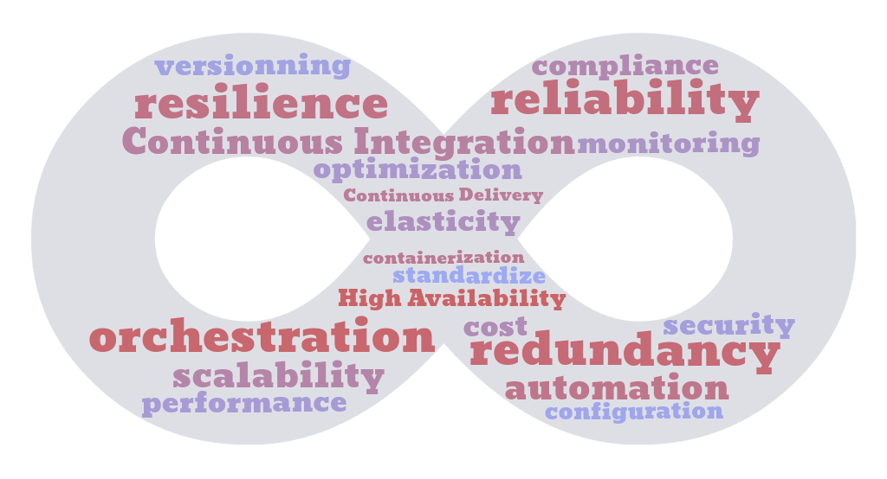

<h1 align="center">Welcome 👋, enjoy my secret garden
</h1>

    

# About Me

Hello ! I'm Sylvain,

I'm currently doing an apprenticeship to become a Cloud/DevOps engineer at Polytech Montpellier. My position at Atos Montpellier is SRE Engineer (Site Reliability Engineering). My passion for IT and the DevOps world continues to grow every day. On my GitHub profile, you can find all the projects I've worked on.

I love discovering new tools and integrating them into my work. I'm a firm believer in the proverb "A rolling stone gathers no moss".

My values can be represented by this cloud of words:

    

# Some Projects

| Name                                                       | Description                                                                      |
| ---------------------------------------------------------- | -------------------------------------------------------------------------------- |
| :robot: **Automating RKE2 Cluster (multi-machines) Setup** | Automating RKE2 Cluster (multi-machines) Setup with Vagrant and Playbook Ansible |
| :books: **PolyNotes**                                      | A productivity and organization tool Platform                                    |
| :timer_clock: **Block Time Manager**                       | Time tracking tool, built using MongoDB, for tracking time spent on projects     |
| :triangular_ruler: **ArchiManager**                        | Project(s) and client(s) organization tool for architects                        |
| :takeout_box: **Docker Terminal UI**                       | Visualization tool for docker                                                    |

You can explore all my projects and find more information about my work [here](https://cluster-2022-9.dopolytech.fr).

Feel free to check them out and provide feedback!

# Tech Stack

## :speech_balloon: Langage(s)

## :framed_picture: Framework(s)

## :runner: CI/CD

## :gear: Infrastructure

## :cloud: Cloud(s)

## :floppy_disk: Database(s)

## :computer: OS

# More

|  |  |
| -------------------------------------------------------------------------------------------------------------- | ---------------------------------------------------------------------------------------- |

# How to reach me

- [📫 Linkdin](https://www.linkedin.com/in/sylvain-pierrot-4a5429170/)
